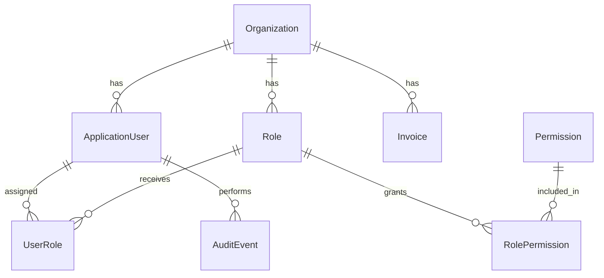
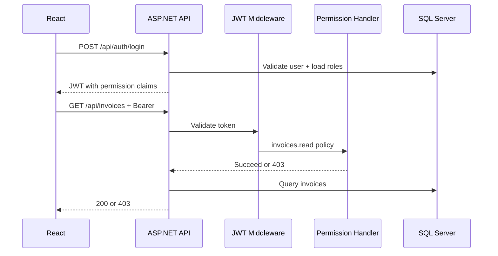

# AccessHub Architecture

## RBAC model

- **Permission**: global catalog (`invoices.read`, `users.write`, …)
- **Role**: scoped to one organization; holds many permissions
- **User**: belongs to one organization (except super admin); has many roles
- **Super admin**: `IsSuperAdmin = true`, no org; all permissions in JWT

## Request flow

## Layers

| Layer | Responsibility |
|-------|----------------|
| **Domain** | Entities, permission code constants |
| **Application** | `IPermissionService`, DTOs, use-case interfaces |
| **Infrastructure** | EF Core, Identity, JWT token generation, audit persistence |
| **Api** | HTTP, authorization policies, controllers |

## Security notes (MVP)

- Passwords hashed via ASP.NET Identity
- JWT signed with symmetric key (configure via `Jwt:Key` in appsettings)
- CORS limited to `http://localhost:5173` in development
- Do not commit production secrets; use user secrets or environment variables

## Future improvements

- Refresh tokens and permission version claim
- Row-level security filters on all org-scoped queries
- Policy-based ABAC (deny overrides)
- Azure AD / OIDC federation
